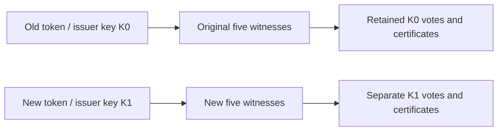

# Witness replacement: preserve old cohorts, rotate future issuance

Status: **v0.4 pilot decision and executable validation, 2026-10-01**. This specifies the operational boundary supported by the current code. It does not implement same-key reconfiguration, automatic replacement, token conversion, or a distributed membership authority.

## Decision

Keep each RSA issuer key pinned to its original five witnesses and four-vote threshold for its whole lifetime. To use a different volunteer cohort, add a **fresh RSA issuer key and shared issuance period** to a successor policy signed by the existing community authority. Retain every previous policy entry and all previous histories. New tokens use the new cohort; old tokens continue to use only their original cohort.

This restores a path for **newly issued** permissions when the old cohort loses availability. It does not move the old cohort's obligations, recover an unavailable old quorum, or prove an unused old token deserves a replacement. Issuance still requires the volunteer issuer to come online and approve batches; no permanent operator or always-on service is introduced.

Do not lower the threshold, clone a witness key with empty or stale history, replace a member under the same issuer key, or silently turn old allowances into new ones. A restart with the current intact history is different from replacing a lost witness. A replacement is a new identity, and a changed endpoint is also a changed membership pin in the current protocol.

## Why a sequence of small replacements is unsafe

For two four-signature certificates over five-member sets that differ by r members, their minimum intersection is `max(0, 3 − r)`. With at most one fixed equivocating identity across their union, the intersection must contain more than one identity to guarantee an honest witness that remembers its earlier vote.

The [executable model and retained output](../evals/witness-reconfiguration-2026-10-01.json) enumerate all 25 pairs of four-member subsets for each of six overlap sizes: **150 pairs**. Identities are symmetric; this is an exhaustive intersection calculation, not an exhaustive asynchronous protocol model or a security audit.

| Members replaced relative to an older still-valid set | Minimum intersection | Certificate pairs without guaranteed honest overlap |
|---:|---:|---:|
| 0 | 3 | 0 / 25 |
| 1 | 2 | 0 / 25 |
| 2 | 1 | 6 / 25 |
| 3 | 0 | 16 / 25 |
| 4 | 0 | 25 / 25 |
| 5 | 0 | 25 / 25 |

A single isolated replacement has enough intersection under these assumptions. That does **not** authorize an arbitrary sequence of replacements: clients, destinations, and old witnesses can retain older configurations during partitions.

Consider `ABCDE → ABCDF → ABCFG`. Each adjacent pair has sufficient overlap, but the oldest and newest do not:

- The old set signs binding X with **A, B, D, E**.
- The latest set signs conflicting binding Y for the same issuer/token with **A, C, F, G**.
- Only **A** signs twice. B, D, E remember X; C, F, G have never signed X. The intermediate configuration need not accept anything.

The cryptographic regression builds both certificates with real signatures and verifies each against its own set. It also verifies that Resonance's installed-policy successor check **rejects** the membership change under the existing issuer key. This is a counterexample to relaxing that check, not an exploit of the current pinned-membership implementation.

The model assumes honest identities retain history and at most one identity is ever Byzantine across the compared sets. It does not establish safety against an attacker that successively compromises several retired signing keys. Keeping old configurations discoverable/current is a separate problem from checking a signature.

## Research basis and applicability

- [Duan and Zhang, *Foundations of Dynamic BFT* (IEEE S&P 2022)](https://eprint.iacr.org/2022/597.pdf), especially the system model and state-transfer protocol, treats membership changes and historical-state transfer as protocol operations. Its joining replicas obtain state before normal participation. **Our inference:** preserving the fixed-set intersection argument alone is insufficient to implement dynamic witnesses. Resonance does not implement Dyno or a replicated total-order log.
- [Steinhoff et al., *BMS: Secure Decentralized Reconfiguration for Blockchain and BFT Systems* (2021)](https://arxiv.org/abs/2109.03913) discusses stale membership and long-range attacks. It illustrates why authentic old signatures do not by themselves tell a reconnecting client which membership is current. We adopt that threat consideration, not the paper's blockchain membership service.
- [Ongaro and Ousterhout, *Raft*, §6](https://raft.github.io/raft.pdf) illustrates transitional configurations and joint agreement. Raft's failure model is non-Byzantine, so copying its majority rule would not establish the one-malicious-witness guarantee required here.

The choice of fresh issuer-key cohorts is our bounded pilot decision. These references do not constitute a proof or external review of Resonance.

## Behavior during rotation



The histories are logically separated by issuer key even when one device stores both in the same bounded snapshot. Membership need not overlap across *different RSA issuer keys*: the old token cannot verify under the new key. Overlapping volunteers keep their existing histories; a genuinely new witness initializes only its own new identity and serves only issuer entries naming that identity.

| Situation | Permitted behavior |
|---|---|
| One original witness unavailable | Four originals can authorize new uses while the old key permits new spends. |
| Only three originals reachable | No new old-key certificate, even if five replacement witnesses are online. Existing provisional votes remain reserved. |
| Fourth original returns before cutoff | Retry the exact request; retained votes can complete its certificate. |
| Destination has the old certificate and local spend | An exact retry can work without witness connectivity until retry/policy/request expiry. It does not authorize a different request. |
| New key, new token, four new witnesses reachable | New work can proceed independently of the old cohort. |
| Old token presented with new setup metadata | It remains an old token; the signed token identifies its key and scope. It is not converted. |
| Old new-spend cutoff reached | A destination refuses an old token it never recorded, including one with votes elsewhere. Local recorded retries may continue. |
| Old retry cutoff or current policy expiry reached | Reject even a cached old retry. Keep history; expiry is not permission to delete or reset it. |
| Old witness loses history | Leave that identity unavailable. Do not initialize it again or restore a stale snapshot and resume signing. |

The distinction between a cached certificate and a locally recorded spend matters: the local verifier checks its own spend log before allowing retry-only admission. An old certificate at a different destination does not grant a new destination a post-cutoff first acceptance. Operation-specific replay checks remain necessary because an identical binding can be presented to multiple destinations.

## Volunteer governance and cutover procedure

The pilot has one independently pinned, offline community authority. This is an explicit trusted role, not decentralized governance. Witness agreement on token uses does not elect members or authorize configuration changes. A timeout is evidence of unreachability, not proof of failure, independence, or permission to replace someone.

1. **Review the outage and inventory locally.** Retain the current signed policy, each role's own latest encrypted histories and storage keys, and its highest installed revision. Never publish spend digests or member activity as part of this inventory. Identify whether a witness is temporarily offline, permanently lost, or merely changing address. Brief outages use exact retries and the original cohort.
2. **Agree a new cohort and allowance.** The community selects five volunteer identities, their secure endpoints and authorized coordinators. Distinct keys/URLs do not prove independent operators. Check expected overlapping availability and owner willingness. Choose a fresh shared period and an explicit new permit budget. Approval of additional issuance is separate from a supposed refund of old tokens.
3. **Prepare a successor under the existing authority.** Generate a fresh RSA issuer key using the existing issuer setup, retain all prior key entries, add the new profile/set, increment the revision and make it active. Existing entries retain their membership, endpoints, coordinators, scope and start date; retirement cutoffs may only shorten. Keep the cohort shared across recipients rather than issuing per-person keys that could identify them.
4. **Install and verify before issuing.** Use the existing signed-policy file exchange with old/new witnesses, destination coordinators, issuer and wallets. Existing devices retain their directories and start without initialization. Only genuinely new roles initialize new state. Standalone relays currently require restart for policy changes. Confirm the intended devices can verify the authority and new revision and that four new witnesses can cooperate; installation on some devices does not establish network-wide activation.
5. **Approve new blinded batches explicitly.** New permits belong to the new issuer ledger/key. Old wallets retain reservations and token histories. Undelivered old tokens can remain blocked or expire if the original quorum never returns. There is no automatic token swap, refund, or allowance transfer in this decision.
6. **Retain and retire.** Keep old witnesses and histories available for old-key recovery for as long as their promises permit and operators can contribute. Enforce installed cutoffs and policy expiry. Do not compact, drop prior key entries, reset quotas, or reuse identities as part of rotation.

Shortening old dates is **not immediate revocation**: a device with an older, still-valid signed policy can continue using its original dates until it receives the update or that policy expires. Keeping the old membership fixed preserves its original conflict-prevention boundary under the honest-authority/one-fault assumptions. It does not synchronize total allowance across old and new keys. Choose overlapping allowance deliberately; clocks are trusted and cross-device authority equivocation remains unresolved.

### Finite pilot limits

- A signed policy accepts at most **eight retained issuer keys**; successor validation forbids removing prior entries. Starting with one key allows at most seven additions under the current format, potentially fewer due to size limits. Do not clear policy storage to rotate again.
- Each witness/coordinator history still shares its existing count and byte limits across keys. A fresh issuer key does not free space on existing roles. Local issuer ledgers also remain authoritative per key; rotation does not establish one network-wide quota.
- Expiry does not prove every offline device knows a revocation, nor prevent storage rollback or later compromise of retired keys. Safe historical-state compaction, authority recovery, and a fresh device's policy-freshness check require separate designs.

## Requirements before replacing members under an existing key

If preserving old tokens across a changed cohort becomes necessary, implement and review a separate Byzantine reconfiguration protocol. The following are requirements, **not an approved wire format or an implemented algorithm**:

1. One authenticated transition order and a way for offline/rejoining nodes to establish freshness, including conflicting authority revisions and non-adjacent configurations.
2. Durable stopping rules for the old configuration, so old votes cannot keep creating untracked decisions during or after handoff. A timeout or a single operator's signature is not evidence that all relevant old obligations were transferred.
3. Bounded, authenticated state transfer that includes **provisional votes as well as certificates**, plus writes concurrent with transfer. Copying only completed certificates can forget votes whose replies were lost. A signed snapshot hash authenticates bytes, not their completeness or freshness.
4. A deterministic conservative rule for conflicting partial votes that never releases a digest capable of forming an earlier certificate. Existing completed certificates and exact retries must remain verifiable. No last-writer-wins merge or refund on timeout.
5. New-member readiness and activation rules justified under an explicit fault model across old/new sets and successive transitions. Specify crash recovery after every durable step, malicious omission, stale/corrupt snapshots, and costs under owner limits.
6. A refusal/recovery path when the old group cannot provide sufficient evidence. Reconfiguration cannot manufacture lost history; availability must not silently override safety.

The current local evidence does not resolve these requirements. A joint old/new vote is an idea to analyze, not a drop-in replacement for state transfer and configuration finality.

## Validation and next implementation

Run the finite model with:

```sh
npm run eval:witness-reconfiguration
```

`packages/eval/src/__tests__/witness-membership.test.ts` checks the intersection boundary, successive-replacement counterexample, and independence from identity ordering. `packages/relay/src/__tests__/witness-rotation.test.ts` checks real conflicting signatures under hypothetical changed membership, current rejection of that change, and new-key rotation using the actual signed-policy stores, encrypted vote/certificate histories and Blind RSA tokens. The transport in the rotation test is an injected in-process dispatcher with controlled reachability; it is not another network benchmark.

The rotation test uses disjoint cohorts and verifies partial old-vote recovery, independent new-key admission, refusal to relabel an old token into the new cohort, exact old retries after coordinator restart with all witnesses offline, retirement, preserved certificate bytes, and rollback refusal. Existing socket/crash suites remain the evidence for network and process boundaries.

Checkpoint validation: TypeScript compilation and the final local suite passed: **104 files / 517 tests**. The preceding GitHub run failed on an occupied guessed port in the reverse-replica-placement fixture (510 tests passed; two skipped after setup failed). That fixture now uses OS-assigned ports for its controller and six outbound-only volunteers, with local listener inspection after restart. Its three focused discovery/replication checks also pass with a single worker. This fixes the observed fixture collision; remote CI remains a separate check.

**Next implementation:** an offline rotation preparation/check command that verifies the previous signature and successor rules before signing, summarizes old/new cohorts and deadlines without token identifiers, flags policy/history capacity limits that it can actually inspect, and refuses overwriting outputs or treating replacement as a refund. Actual deployment readiness and local inventories must remain explicit; the command cannot certify remote history or uptime. Same-key live replacement and automated governance remain future work.
